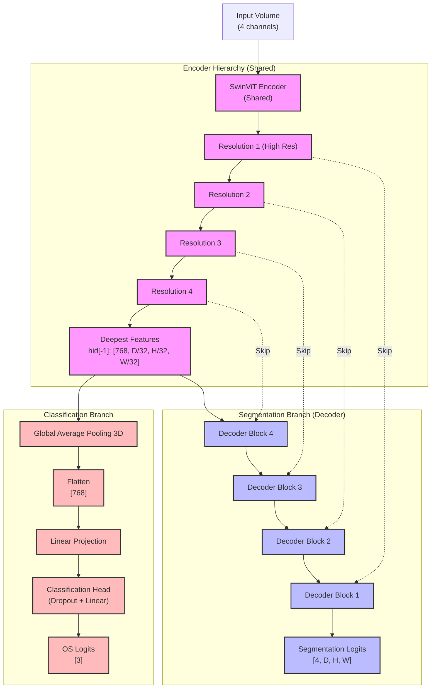

# Baseline Multitask Architecture (AVLT-Adapted)

This document provides a comprehensive analysis of the baseline Swin3D multitask architecture used in this project. This architecture was adapted from the existing AVLT (Audio-Visual-Language-Text) architecture paradigm to handle 3D medical images for simultaneous Overall Survival (OS) classification and Tumor Segmentation.

## 1. Background and Design Insights

The original AVLT model was designed for cross-modal alignment (e.g., vision and text). To adapt this for our multitask BraTS scenario (where no text modality is present for these specific runs), the architecture was expanded into the `AVLTVisionMultitask` model.

### **Core Design Principles of the Baseline:**
- **Shared Representation Learning:** The backbone relies on MONAI's **SwinUNETR**. The underlying hypothesis is that a shared SwinViT encoder can learn generic, rich spatio-semantic features from 3D MRI volumes that are broadly useful for both bounding/segmenting tumors and predicting survival.
- **Hierarchical Decoder for Segmentation:** The U-Net style decoder utilizes skip connections to reconstruct high-resolution, voxel-wise predictions for edema, necrosis, and enhancing tumor masks.
- **Deepest Features for Global Context:** For the OS classification task, the model taps into the very bottom of the encoder bottleneck (`hid[-1]`, at $1/32$ resolution). The insight here is that the deepest features contain the most abstract, global, patient-level contextual information needed for a holistic prognosis.
- **Global Average Pooling (GAP):** To convert the 3D spatial tensor into a 1D classification vector, GAP is applied across the spatial dimensions, followed by a linear classification head.

---

## 2. Current Architecture Flow

---

## 3. Structural Flaws & Convergence Bottlenecks

While the shared-encoder paradigm is standard, our deep dive reveals **six fundamental design flaws** that cause severe convergence imbalance (segmentation drives the network, while classification struggles).

### Flaw 1: Gradient Domination (The Volume vs. Vector Imbalance)
- **The Issue**: The `SwinViT Encoder` is entirely shared. The Segmentation Loss (DiceCE) generates dense gradients across millions of voxels ($128 \times 224 \times 224$). The Classification Loss (CrossEntropy) generates merely a single gradient vector per patient.
- **Impact**: The massive volume of segmentation gradients drowns out the classification gradients during backpropagation. The shared encoder weights optimize almost exclusively for spatial boundaries, treating survival prediction as an afterthought.

### Flaw 2: Spatial Dilution via Global Average Pooling (GAP)
- **The Issue**: Classification relies on `AdaptiveAvgPool3d(1)` applied to the deepest feature map. 
- **Impact**: GAP literally averages the entire 3D volume. In typical BraTS scans, the tumor occupies < 5% of the brain. GAP dilutes the critical, highly localized survival signals hidden inside the tumor with 95% noise from healthy tissue and background.

### Flaw 3: Isolated Branches (No Spatial Synergy)
- **The Issue**: The classification branch splits off *before* the decoder. It does so blindly, having to independently figure out where the tumor is. 
- **Impact**: The network wastes capacity. The segmentation decoder perfectly localizes the bounding box and exact subregions (edema, necrosis, enhancing tumor), but the classification branch never sees or benefits from this rich spatial awareness.

### Flaw 4: Severe Capacity Bottleneck
- **The Issue**: The classification head is a mere single-layer linear projection (`nn.Linear(768, num_classes)`). Conversely, the segmentation task gets an entire 5-stage U-Net decoder with complex transposed convolutions and residual blocks.
- **Impact**: Extracting abstract survival patterns (like tumor heterogeneity) requires non-linear processing power. A single linear layer is starved of the parameters needed to untangle such complex features.

### Flaw 5: Semantic Gap (Ignoring High-Res Textures)
- **The Issue**: OS classification relies purely on the deepest encoder features (`hid[-1]`, stride 32). These features capture highly abstract global semantics but lose fine-grained local textures. 
- **Impact**: Patient survival often heavily depends on micro-textures (e.g., fine-grained necrotic heterogeneity, microvascular proliferation). These are present in earlier, high-resolution layers (`enc0`, `enc1`), which the classification branch completely ignores (unlike the segmentation branch, which uses them via skip connections).

### Flaw 6: Task Interference (Negative Transfer)
- **The Issue**: Segmentation strictly requires learning *translation-equivariant* features (preserving exactly *where* the tumor boundaries are). Classification requires learning *translation-invariant* features (capturing *what* the overall prognosis is, regardless of where the tumor sits in the brain). 
- **Impact**: Forcing a single shared encoder to learn mathematically opposing feature types simultaneously, without any task-specific modulation layers in the encoder, leads to negative transfer. Features optimal for one task degrade performance on the other.

---

## 4. Suggested Architectural Fixes

To resolve the convergence race and stabilize the classification branch, the following structural upgrades are recommended for the next architectural iteration:

1. **Tumor-Aware Masked Pooling (Resolves Flaws 2 & 3):** 
   Replace GAP with an **Attention Mask** driven by the segmentation decoder's output. Multiply the deep features by the segmentation probabilities before pooling to force the classification vector to represent *only* the tumor region, dropping healthy tissue noise.
   
2. **Multi-Scale Feature Aggregation (Resolves Flaw 5):**
   Extract pooled features from multiple stages of the decoder (high-res + low-res) and concatenate them before the classification head, providing access to both local micro-textures and global semantics.

3. **Stop-Gradient / Detached Routing (Resolves Flaw 1):** 
   Implement detach operations or use specialized modulation blocks to prevent the overwhelming segmentation gradients from completely overwriting the classification representations in the shared encoder.

4. **Multi-Layer Perceptron (MLP) Head (Resolves Flaw 4):**
   Upgrade the classification head from a simple `Linear` projection to a non-linear MLP with hidden layers and activation functions (e.g., `Linear -> GELU -> Dropout -> Linear`).
